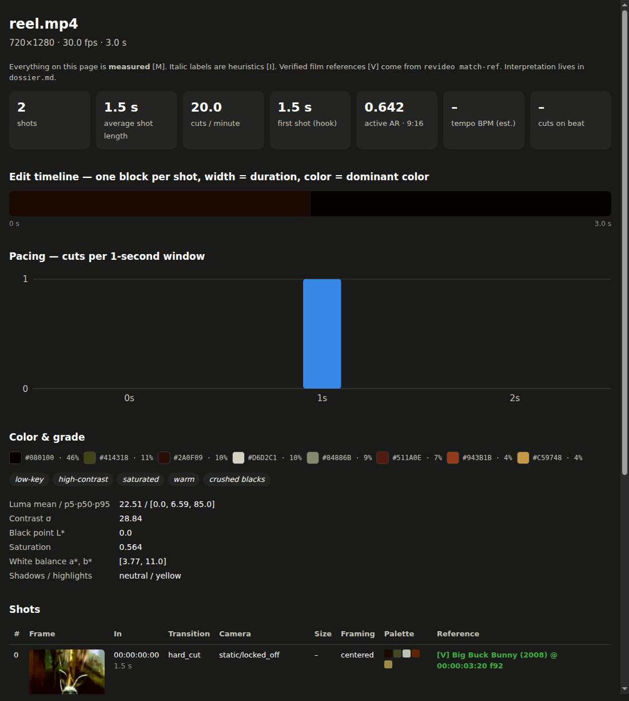

# Reverse Engineering Video — Content

[](https://github.com/TimothyArcher90/reverse-engineering-video-content/actions/workflows/tests.yml)


**Ingeniería inversa total de contenido audiovisual.** Le das un video (reel, TikTok, Short, anuncio,
videoclip, escena de película) y obtienes:

1. **Qué es y cómo está hecho** — cortes, ritmo, planos, movimiento de cámara, encuadre, paleta y
   gradación de color, sonido.
2. **De dónde viene** — referencias cinematográficas (película, año, director, director de fotografía)
   con **fotograma y timecode exactos** cuando se puede verificar.
3. **Con qué herramientas y qué flujo** se produjo probablemente, siempre con la señal que lo delata.
4. **Cómo replicarlo** — plan con IA, plan con rodaje real, postproducción y un pack de prompts por plano.
5. **Qué tan fiel quedó tu réplica** — puntuación 0–100 comparando original y réplica.

Cada afirmación lleva su nivel de evidencia: **[M]** medido · **[O]** observado · **[I]** inferido ·
**[V]** verificado · **[?]** desconocido. Una referencia es hipótesis hasta que se verifica.

<p align="center"></p>
<p align="center"><sub><code>report.html</code> de un reel derivado de <i>Big Buck Bunny</i> (recorte 9:16, espejado y re-gradado):
el plano 0 se verifica en el fotograma 92 (00:00:03:20). Imagen: © Blender Foundation, CC BY 3.0.</sub></p>

## Arquitectura

```
 video / URL
     │
 L0  ingest ─────── yt-dlp: video + subtítulos + metadatos de la plataforma
 L1  shots ──────── cortes (detector propio: color + estructura + rechazo de destellos)
                    fundidos a negro · keyframes in/mid/out · contact sheet
 L2  por plano ──── paleta (k-means en Lab) · gradación (key, contraste, punto de negro, WB, split-tone)
                    encuadre (área activa/letterbox, tercios, simetría, caras → tamaño de plano)
                    cámara (pan/tilt/zoom/roll por segundo, en mano vs estabilizada)
 L3  sonido ─────── loudness · onsets · BPM · beats · % de cortes sobre el beat
 L4  huella ─────── ASL, cortes/min, curva de ritmo, gancho 0–3 s, paleta y look globales
     │                                   ▲ todo lo anterior es MEDIDO → analysis.json, report.md/.html
 L5  agente ─────── skill/SKILL.md: observa keyframes, propone referencias, infiere el stack,
                    escribe el dossier (16 secciones), plan de réplica y prompts
     │
 REF match-ref ──── fotograma exacto en la película (pHash sobre recortes 9:16/4:5/1:1 izq/centro/der,
                    espejado, re-gradado) + refinado fotograma a fotograma → [V]
 QA  compare ────── réplica vs original → fidelidad 0–100
```

## Instalación

```bash
git clone https://github.com/TimothyArcher90/reverse-engineering-video-content
cd reverse-engineering-video-content
pip install -e ".[full]"          # numpy, opencv, yt-dlp, ffmpeg embebido, pyscenedetect (opcional)
revideo doctor
```
Opcional: `pip install -e ".[whisper]"` para transcribir cuando no hay subtítulos.

### Como skill (sin instalar nada a mano)

El skill trae la herramienta dentro y las dependencias se instalan solas la primera vez.

| Dónde | Cómo |
|---|---|
| claude.ai / app de Claude | Descarga `reverse-engineering-video.skill` (artefacto del CI o `python tools/build_skill.py`) y súbelo en *Settings → Capabilities → Skills* |
| Claude Code | `./install_skill.sh` (enlaza `skill/`) o descomprime el `.skill` en `~/.claude/skills/` |

Luego pide *"haz ingeniería inversa de este reel: &lt;link&gt;"*. En claude.ai, las descargas desde URL
dependen de que el entorno de código tenga salida a internet; si no, sube el archivo de video.

## Uso

```bash
# 1. Medir
revideo analyze "https://www.instagram.com/reel/..." -o runs/mi-reel
#    → analysis.json · report.html · report.md · dossier.md · contact_sheet.jpg · keyframes/

# 2. Verificar una referencia (necesitas el archivo de la película, legalmente)
revideo index-ref pelicula.mkv -o refs/pelicula --title "Título" --director "Dir." --dp "DoP" --year 1999
revideo match-ref runs/mi-reel refs/pelicula.npz
#   shot   3 [out 00:00:05:10] → Título @ 01:02:14:07 (frame 89623, r=0.97, dist 4, crop 9:16@center, mirrored)

# 3. Tras hacer tu réplica
revideo analyze replica.mp4 -o runs/mi-reel-replica
revideo compare runs/mi-reel runs/mi-reel-replica      # fidelidad 0–100 por componente

revideo report runs/mi-reel                            # regenerar informes
```

| Comando | Qué hace |
|---|---|
| `analyze` | Mide todo y genera los informes. `--engine scenedetect`, `--threshold`, `--no-audio`, `--no-motion`, `--whisper small` |
| `index-ref` | Huella perceptual de una película (solo hashes, no imágenes) |
| `match-ref` | Fotograma exacto por plano; se fusiona en `analysis.json` e informes |
| `compare` | Fidelidad de una réplica: ritmo 30 %, color 30 %, encuadre 15 %, cámara 15 %, sonido 10 % |
| `report` | Regenera `report.md` y `report.html` |
| `doctor` | Comprueba dependencias |

## Validación

17 tests con verdad conocida en CI + pruebas con metraje real
([detalle](docs/VALIDATION.md)):

| Prueba real | Resultado |
|---|---|
| Montaje real de 5 planos (H.264) | 4/4 cortes, error máx. 1 fotograma, 0 falsos positivos |
| Clip de fuegos artificiales (oscuro, destellos) | 1 plano correcto (v0.1 daba 10 planos y 8 fundidos falsos) |
| Reel derivado: recorte 9:16 + espejo + re-gradado + recompresión | Fotograma exacto 92, inicio del plano 2,500 s exacto |

## Límites

| Puede | No puede (o no sin ayuda) |
|---|---|
| Medir cortes, ritmo, color, encuadre, movimiento y sonido de forma reproducible | Saber con certeza qué app o cámara se usó: es inferencia salvo que el autor lo diga |
| Encontrar el fotograma exacto de una película **si tienes el archivo** | Identificar una película "de memoria" con certeza: el agente propone candidatos [I] |
| Detectar recortes 9:16/4:5/1:1 (izq./centro/der.) y espejado | Recortes con zoom o posición arbitraria, cambios de velocidad (menor recall) |
| Puntuar la fidelidad estructural de una réplica | Distinguir zoom de dolly solo con flujo 2D · derechos de uso (ver `docs/LEGAL.md`) |

## Documentación
- [`docs/METHODOLOGY.md`](docs/METHODOLOGY.md) — estándares de ingeniería inversa y límites de cada métrica
- [`docs/SCHEMA.md`](docs/SCHEMA.md) — todos los campos de `analysis.json` y de las coincidencias
- [`docs/VALIDATION.md`](docs/VALIDATION.md) — qué se probó, cómo y con qué resultado
- [`skill/SKILL.md`](skill/SKILL.md) — flujo del agente (7 fases) · [`skill/references/`](skill/references)
- [`docs/LEGAL.md`](docs/LEGAL.md) · [`CONTRIBUTING.md`](CONTRIBUTING.md) · [`CHANGELOG.md`](CHANGELOG.md) · [`CREDITS.md`](CREDITS.md)

Licencia MIT.
